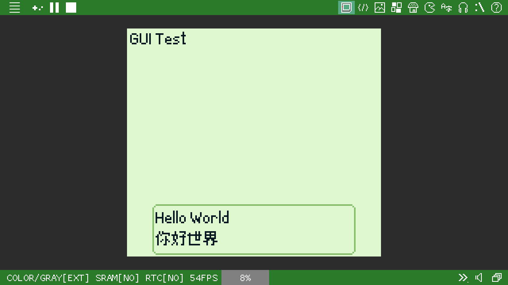
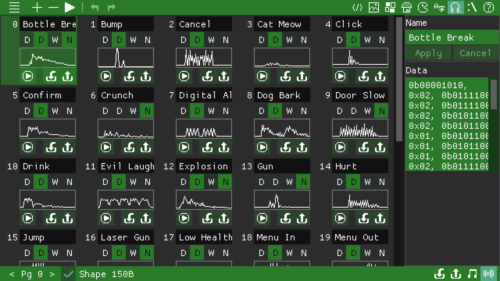

[Home](https://paladin-t.github.io/kits/gbb/) | [Steam](https://store.steampowered.com/app/2308700/) | [Documents](https://paladin-t.github.io/kits/gbb/manual.html) | [About](https://paladin-t.github.io/kits/gbb/about.html)

## About GB BASIC

**GameBuilder BASIC** (**GB BASIC**) is a retro Fantasy Console that generates ROMs compatible with the popular handheld game console. It has everything ready-to-use for writting code, making assets, compiling projects, running with the built-in emulator, exporting to runnable ROM, etc.

### Why GB BASIC?

GB BASIC is programmable in a brand new BASIC dialect. The integrated assets editors are intuitive to use. You can generate real ROMs and play on any GB emulator or hardware.

### Programming Paradigms

- Imperative paradigm
  - Non-structured programming
  - Concurrent processing approach
- Declarative paradigm
  - Data driven approach

### Features

- Programmable in BASIC, an easy to learn and fun to use programming language
- Easy to use API for graphics, input, audio, and other facilities
- Built-in libraries for scene, actor, controllers, GUI
- Built-in libraries for collision detection, persistence, RTC, etc.
- **Extension** feature including mouse & touch, shell command, debugging, etc.
- Handy tools for editing tiles, map, scene, actor, font, sound, etc.
- Project can be exported into real ROM
- Dozens of example projects

### Specs

- **CPU**: 4.19MHz/8.38MHz for classic/colored respectively
- **Threads**: up to 16 concurrent execution contexts
- **Display**: 160x144px
- **Code**: BASIC, supports multiple source pages
- **Gamepad**: 8 buttons (D-Pad + A/B + Select/Start)
- **Mouse and touch**: supported by **extension**
- **Tiles**: up to 256 units per page
- **Map**: up to 255 tiles in one dimension per page; two layers (graphics, attributes)
- **Sprite**: supports 8x8 and 8x16 sprites
- **Scene**: up to 255 tiles in one dimension per page; four layers (map, attributes, properties, actors)
- **Actor**: up to 8x8 tiles per frame; up to 1024 frames per page
- **Font**: supports TrueType (.ttf) and bitmap-based (.png .jpg .bmp .tga); up to 16px; 1bpp or 2bpp
- **Audio**: 4 channels; supports importing from JSON, VGM, WAV, FxHammer
- **Palette**: 2bit (4 colors) per tile, palette of map and actor is configurable for colored device
- **GUI**: supports label, progress bar, menu, etc.
- **Persistence**: supported
- **RTC**: supported
- **Serial port**: supported

## Glance








## Installation

### Installing from Prebuilt

- [Steam](https://store.steampowered.com/app/2308700/)

### Compiling from Source

A C++14 capable compiler is required, any compiler came after 2014 should be ok. You need to get this repository and its submodules before build:

```sh
git clone https://github.com/paladin-t/gbb.git
cd gbb
```

#### Windows

Dependencies: Visual Studio (with C++ development tools installed).

<details>
<summary>Steps</summary>

1. Build SDL2
	1. Compile from "lib/sdl/VisualC/SDL.sln"
	2. Execute `lib/sdl/copy_win.cmd`
2. Build GB BASIC
	1. Compile from "gbbasic.sln"
3. Build GBBVM
	1. Execute `gbbvm.cmd`

</details>

#### Linux

Dependencies: CMake, GCC.

<details>
<summary>Steps</summary>

1. Build SDL2
	1. Execute:
		```sh
		cd lib/sdl
		./configure
		make
		sudo make install
		cd ../..
		```
	2. Execute `lib/sdl/copy_linux.sh`
2. Build GB BASIC
	1. Execute:
		```sh
		cd gbbasic.linux
		cmake . && make
		cd ..
		```
3. Build GBBVM
	1. Execute `gbbvm.sh`

</details>

#### MacOS

Dependencies: Xcode.

<details>
<summary>Steps</summary>

1. Build SDL2
	1. Compile dylib from "lib/sdl/Xcode/SDL/SDL.xcodeproj"
	2. Reveal "libSDL2.dylib" in Finder
	3. Copy "libSDL2.dylib" to "lib/sdl/lib/mac/"
2. Build GB BASIC
	1. Compile from "gbbasic.xcodeproj"
3. Build GBBVM
	1. Execute `gbbvm.sh`

</details>

#### Other platforms

<details>
<summary>Details</summary>

You can also setup your own build pipeline for other platforms. The "lib" and "src" directories are almost what you need.

The "platform_*" files contain most platform dependent code, you'll probably make a specific port.

</details>

## Learning

### Documentation

- [Manual](https://paladin-t.github.io/kits/gbb/manual.html)
- [Extensions](https://paladin-t.github.io/kits/gbb/extensions.html)
- [Launching](https://paladin-t.github.io/kits/gbb/launching.html)
- [Troubleshooting](https://paladin-t.github.io/kits/gbb/troubleshooting.html)
- [Changelog](https://paladin-t.github.io/kits/gbb/changelog.html)
- [About](https://paladin-t.github.io/kits/gbb/about.html)
